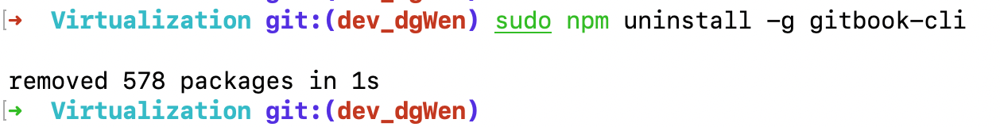
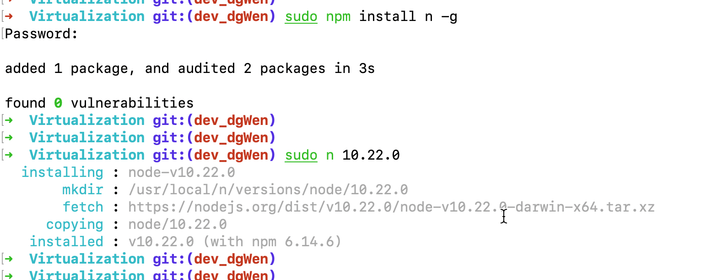
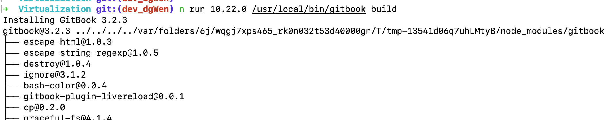

# 01、环境准备

> 1. 安装node.js
> 2. 安装gitbbook-cli

## 01.安装 `node.js`

> Node.js 的版本不能太高，有些版本配合着gitbook是有问题的。这里列举我的全部版本信息。
>
> - node：v15.9.0
>
> - npm：7.5.3

地址：[nodejs官方地址](https://nodejs.org/en/download/)

历史版本：https://nodejs.org/dist/

下载好后，无脑下一步安装。

- 校验是否安装成功, 查看node和npm的版本信息，可以看到就是正确安装了。

    ```shell
    $node -v
    v15.9.0
    
    $npm -v
    7.5.3
    ```


## 02.安装 `gitbook-cli`

> 相关版本信息：
>
> - CLI version: 2.3.2
>
> - GitBook version: 3.2.3

1. 安装gitbook-cli

```bash
$npm install gitbook-cli -g
```

2. 查看版本信息,出现版本信息就是成功了

```bash
$gitbook --version
$gitbook -V

CLI version: 2.3.2
GitBook version: 3.2.3
```


## 03.卸载`node、npm`

```shell
sudo npm uninstall npm -g
sudo rm -rf /usr/local/lib/node /usr/local/lib/node_modules /var/db/receipts/org.nodejs.*
sudo rm -rf /usr/local/include/node /Users/$USER/.npm
sudo rm /usr/local/bin/node
sudo rm /usr/local/share/man/man1/node.1
sudo rm /usr/local/lib/dtrace/node.d
```

验证是否成功：

```bash
$node -v                     
zsh: command not found: node
$npm -v                      
zsh: command not found: npm
```


## 04.卸载`gitbook-cli`

```bash
$sudo npm uninstall -g gitbook-cli
```




## 05.常见错误

### 1.node版本问题

```bash
$gitbook --version
CLI version: 2.3.2
Installing GitBook 3.2.3
/usr/local/lib/node_modules/gitbook-cli/node_modules/npm/node_modules/graceful-fs/polyfills.js:287
      if (cb) cb.apply(this, arguments)
                 ^

TypeError: cb.apply is not a function
    at /usr/local/lib/node_modules/gitbook-cli/node_modules/npm/node_modules/graceful-fs/polyfills.js:287:18
```

#### 原因：

gitbook-cli在其github和npm官网上可以看到gitbook-cli已经很久没有更新了。所以最新版本的node执行gitbook build会出现错误也是能想象的。

#### 解决办法

- 安装node版本管理器 n 
- 执行gitbook时指定版本(10.22.0)
- 解决方法不是一种，也可以有其他的方法

安装node版本管理器

```bash
$shell sudo npm install n -g
$sudo n 10.22.0
```



指定版本执行gitbook

```bash
$n run 10.22.0 /usr/local/bin/gitbook build
```




### 2.卸载gitbook-cli错误

```bash
$npm uninstall -g gitbook-cli
npm ERR! code EACCES
npm ERR! syscall rename
npm ERR! path /usr/local/lib/node_modules/gitbook-cli
npm ERR! dest /usr/local/lib/node_modules/.gitbook-cli-zCuNycCn
npm ERR! errno -13
npm ERR! Error: EACCES: permission denied, rename '/usr/local/lib/node_modules/gitbook-cli' -> '/usr/local/lib/node_modules/.gitbook-cli-zCuNycCn'
npm ERR!     at async Object.rename (node:internal/fs/promises:783:10)
npm ERR!     at async moveFile (/usr/local/lib/node_modules/npm/node_modules/@npmcli/fs/lib/move-file.js:30:5)
npm ERR!     at async Promise.allSettled (index 0)
npm ERR!     at async [reifyPackages] (/usr/local/lib/node_modules/npm/node_modules/@npmcli/arborist/lib/arborist/reify.js:246:11)
npm ERR!     at async Arborist.reify (/usr/local/lib/node_modules/npm/node_modules/@npmcli/arborist/lib/arborist/reify.js:165:5)
npm ERR!     at async Uninstall.exec (/usr/local/lib/node_modules/npm/lib/commands/uninstall.js:52:5)
npm ERR!     at async module.exports (/usr/local/lib/node_modules/npm/lib/cli-entry.js:61:5)
npm ERR!  Error: EACCES: permission denied, rename '/usr/local/lib/node_modules/gitbook-cli' -> '/usr/local/lib/node_modules/.gitbook-cli-zCuNycCn'
npm ERR!     at async Object.rename (node:internal/fs/promises:783:10)
npm ERR!     at async moveFile (/usr/local/lib/node_modules/npm/node_modules/@npmcli/fs/lib/move-file.js:30:5)
npm ERR!     at async Promise.allSettled (index 0)
npm ERR!     at async [reifyPackages] (/usr/local/lib/node_modules/npm/node_modules/@npmcli/arborist/lib/arborist/reify.js:246:11)
npm ERR!     at async Arborist.reify (/usr/local/lib/node_modules/npm/node_modules/@npmcli/arborist/lib/arborist/reify.js:165:5)
npm ERR!     at async Uninstall.exec (/usr/local/lib/node_modules/npm/lib/commands/uninstall.js:52:5)
npm ERR!     at async module.exports (/usr/local/lib/node_modules/npm/lib/cli-entry.js:61:5) {
npm ERR!   errno: -13,
npm ERR!   code: 'EACCES',
npm ERR!   syscall: 'rename',
npm ERR!   path: '/usr/local/lib/node_modules/gitbook-cli',
npm ERR!   dest: '/usr/local/lib/node_modules/.gitbook-cli-zCuNycCn'
npm ERR! }
npm ERR! 
npm ERR! The operation was rejected by your operating system.
npm ERR! It is likely you do not have the permissions to access this file as the current user
npm ERR! 
npm ERR! If you believe this might be a permissions issue, please double-check the
npm ERR! permissions of the file and its containing directories, or try running
npm ERR! the command again as root/Administrator.

npm ERR! A complete log of this run can be found in: /Users/whh/.npm/_logs/2024-04-01T03_12_57_979Z-debug-0.log
```

#### 原因：

权限问题，使用sudo卸载即可
