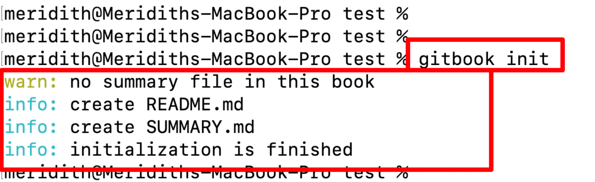

# 01.配置信息

### 1. 初始化项目

```bash
$gitbook init

warn: no summary file in this book 
info: create README.md 
info: create SUMMARY.md 
info: initialization is finished
```




此时出现的信息，并且生成了两个文件。

- README.md —— 书籍的介绍写在这个文件里
- SUMMARY.md —— 书籍的目录结构在这里配置


### 2. 启动项目

```bash
$gitbook serve

Live reload server started on port: 35729
Press CTRL+C to quit ...

info: 7 plugins are installed 
info: loading plugin "livereload"... OK 
info: loading plugin "highlight"... OK 
info: loading plugin "search"... OK 
info: loading plugin "lunr"... OK 
info: loading plugin "sharing"... OK 
info: loading plugin "fontsettings"... OK 
info: loading plugin "theme-default"... OK 
info: found 1 pages 
info: found 0 asset files 
info: >> generation finished with success in 0.2s ! 

Starting server ...
Serving book on http://localhost:4000
```


这时候服务启动了，然后你可以在浏览器中访问： http://localhost:4000 即可看到启动的 `gitbook` 了。


如果想停止的话，直接`Control + C` 即可！

到此就是正常的生成了一个gitbook的项目。然后就可以写自己的内容了。这是最原始的项目了 ，使用一些配置信息，以及一些插件会更加的方便使用和管理。


### 3. 配置信息

> 1. `.bookignore` 文件, 需要手动创建
> 2. `book.js` 文件， 需要手动创建
> 3. `package.json` 文件，手动创建，或者安装插件的时候，会自动的创建。

#### 1.`.bookignore` 文件

> book在build的时候，忽略的文件

```
package.json
package-lock.json
book.js
```


#### 2.`book.js` 文件

这个是书本的配置信息。也可以使用json文件，使用这个是方便写注释信息。

```js

module.exports = {

  // 书籍基本信息
  title: "Harvey's Book", // 书名
  author: "Harvey Wen", // 作者

  // 书籍元数据信息
  description: "The Book of Harvey Wen", // 描述
  isbn: "book NO.", // 国际标准书号
  author: "Harvey", // 作者（此处与上一行重复）
  publisher: "Harvey Wen", // 出版社
  year: "2017", // 出版年份
  language: "English", // 语言
  subject: "Harvey's Book", // 主题
  keywords: "Harvey Wen, book, book of Harvey Wen", // 关键词
  cover: "cover.jpg", // 封面图片文件名
  copyright: "Harvey Wen", // 版权声明
  license: "MIT", // 授权许可协议
  version: "1.0", // 版本号
  xref: "true", // 是否启用交叉引用（具体含义取决于应用场景）

  // 书籍封面（用于PDF导出）
  cover: "cover.jpg",

  // PDF基础路径，存储PDF文件的位置（当前注释掉）
  // basePath: "book",

  // 插件列表
  plugins: [
	// 注意这些插件使用之前都是需要安装的，可以根据自己的需要的自行安装，手动添加其名字到这里。
    // 注意这里的名字和安装的时候的名字关系需要注意一下。比如“code” ，安装时候的名字是 ‘npm install gitbook-plugin-code’ 前面都有一个前缀 “gitbook-plugin-”
    "-lunr",		// -lunr 就是不用这个
    "-search",		// -search 就是不用这个
    "search-pro",	// 搜索的插件信息，需要配合上面的 lunr 和 search 一起使用，搜索支持高亮显示
    "code",			// 代码部分，会显示行号，以及右上角是否可以复制的按钮，下面的PluginsConfig中设置这些信息。
    "expandable-chapters",	// 左边的目录信息是否可以折叠的
    "back-to-top-button",	// 右下角的直接返回顶部的按钮
  ],

  // 插件配置项
  pluginsConfig: {
    code: {
      copyButton: true, // 是否可复制按钮
    },
  },

  // 自定义变量区域
  variables: {

    // 可在此处定义和添加自定义变量

  },
};
```


#### 3.`package.json` 文件

```json
{
  "name": "book1",
  "version": "1.0.0",
  "description": "",
  "main": "index.js",
  "scripts": {
    "test": "echo \"Error: no test specified\" && exit",	
    "serve": "gitbook serve",	// 自己创建脚本，方便npm使用，npm run serve 启动服务
    "build": "gitbook build",	// 自己创建脚本，方便npm使用，npm run build 构建
    "update": "gitbook update",	// 自己创建脚本，方便npm使用，npm run update 更新服务
    "pdf": "gitbook pdf",
    "epub": "gitbook epub",
    "mobi": "gitbook mobi"
  },
  "author": "Harvey Wen",
  "license": "ISC",
  "dependencies": {	// 这里的信息都是插件信息，安装的时候，会自动的添加到这个里面，插件的名字，和版本号
    "gitbook-plugin-back-to-top-button": "^0.1.4",
    "gitbook-plugin-code": "^0.1.0",
    "gitbook-plugin-expandable-chapters": "^0.2.0",
    "gitbook-plugin-search-pro": "^2.0.2",
    "gitbook-summary": "^1.2.4"
  }
}
```


### 4.常用插件安装

```bash
# 右下角按钮，返回顶部
$npm install gitbook-plugin-back-to-top-button
# 代码部分，显示行号，以及右上角是否支持点击复制
$npm install gitbook-plugin-code
# 左边目录支持折叠
$npm install gitbook-plugin-expandable-chapters
# 支持高亮搜索
$npm install gitbook-plugin-search-pro
```


### 5. `summary` 生成文件

> 在开始的时候, 使用git init的时候会初始化整个项目, 如果在summary中定义好了需要的文件目录, 然后再去初始化就会自动创建出文件的. 方便使用.

#### 1.定义`summary`, 初始化项目

```markdown
- [Introduction](README.md)
- [Chapter 1](chapter1.md)
  - [Section 1.1](chapter1/section1.1.md)
  - [Section 1.2](chapter1/section1.2.md)
- [Chapter 2](chapter2.md)
```

使用以上`summary.md`中的信息, 去执行gitbook init,创建这些文件.


#### 2.修改`summary`, 添加新的文件

> 如果后续修改了 summary 文件,然后需要生成新的文件, 如果再去执行上面的命令`gitbook init` 的话, 就会覆盖掉之前的全部文件, 然后重新生成新的文件.不符合我们的需求,而且一不小心还会覆盖掉之前全部的笔记.

```bash
$gitbook init --add summary.md
# or
$gitbook init --force
```

这两个命令都是可以只添加你修改的的summary文件中新的文件,并且**不会覆盖**你之前已经写的文件了.


### 6.`md` 文档编辑工具推荐

https://typora.io/


